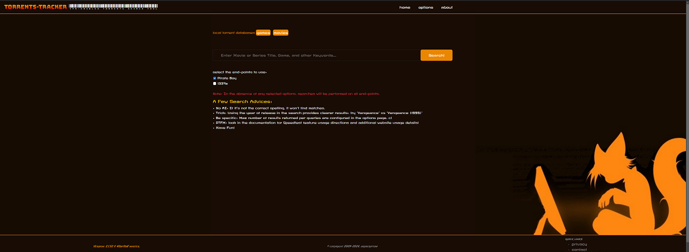
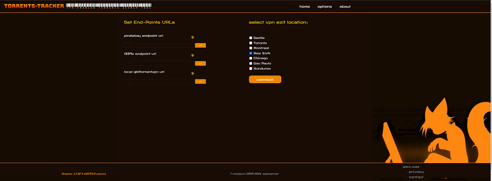
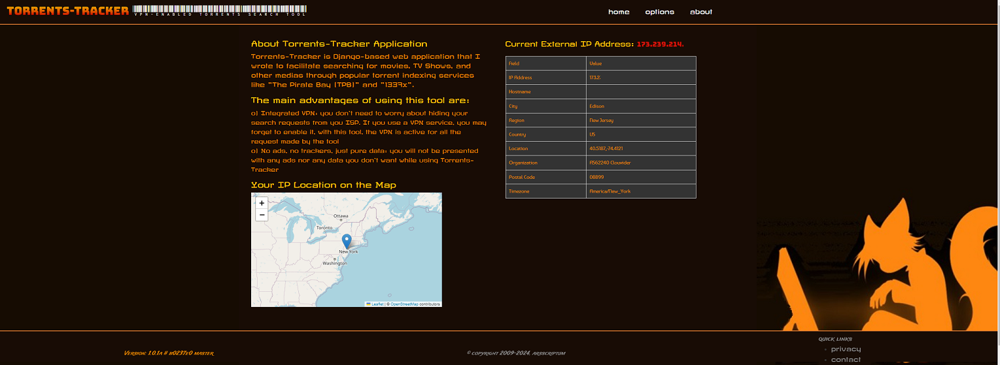
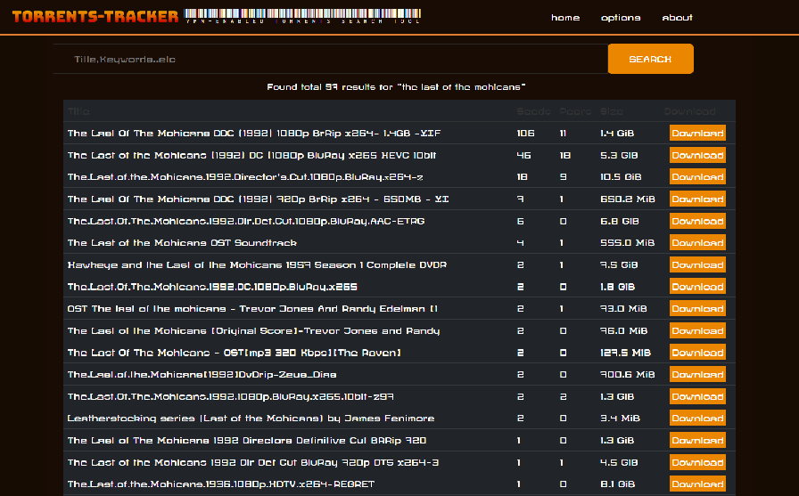
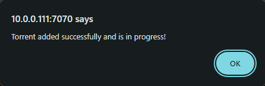
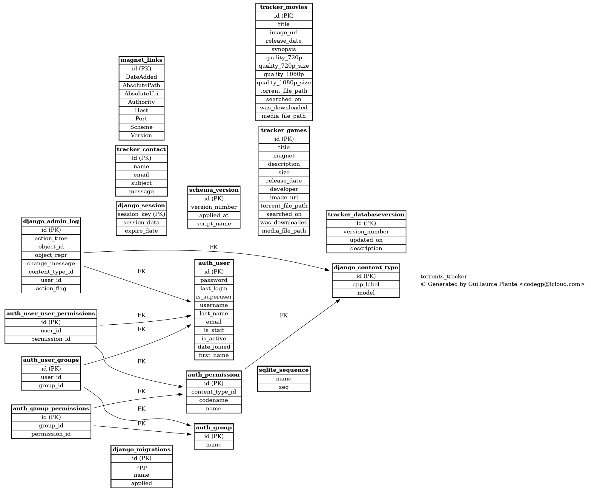
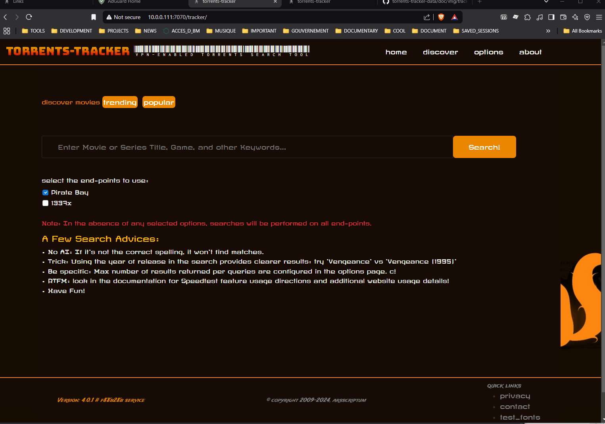

# Torrents Tracker - Data Repository

 
Public data for [torrents-tracker](https://github.com/arsscriptum/torrents-tracker).
This is an application to query different torrents indexers (i.e. PirateBay) to find differents media files. 

## Data Repository

Contains only the public data files fetch for versioning

## Looks and Feel

### How to Search

### Options

### About Page

### Results Page

### Download a Item

#### Database View

## DEMO: Popular Title Search

**NOTE** Yeah! I fixed that pop up message when the magneet link is sent to *qbittorrentvpn* (when I press download)

## DEMO: VPN Server Selection

I use **EXPRESS VPN** but with minor code changes, you can use your own VPN provider.

**NOTE** In  order to reduce the video lenght, I removed the time after I reset the VPN location. This launches a script that will stop the docker container, change the docker-compose.yml file and restart the compose stack. It's not hugely long, but it'smore than  what's  shown. Like 30 seconds...